# Lab [2]

## Create a new project on your local machine,then push it your remote repo.
### Create remote repo
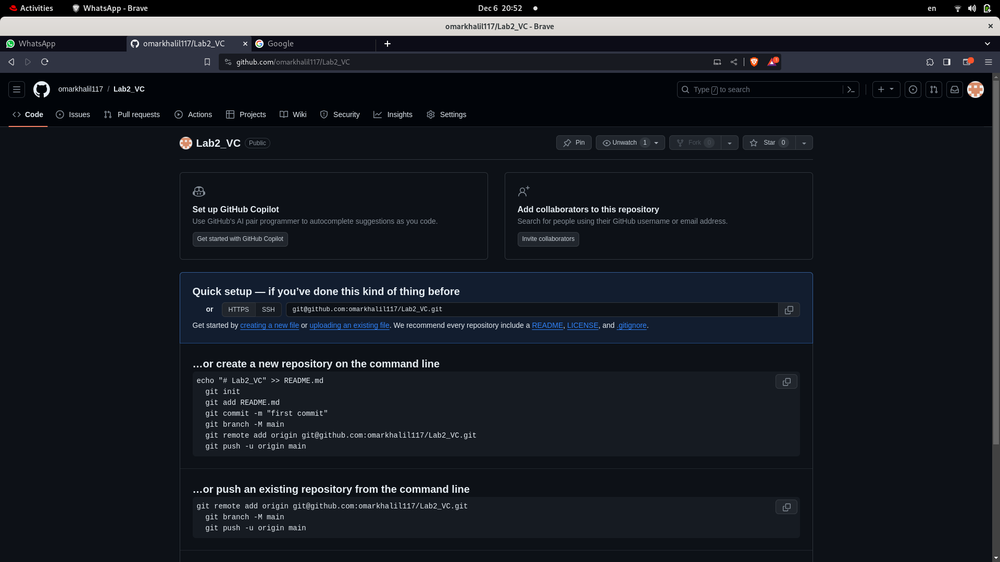
### Create local repo using *git init* command
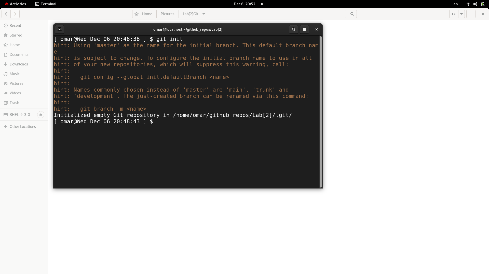
### Connect remote repo with local repo using *git remote add origin [mysshlink]*
### add first commit with Readme.md file
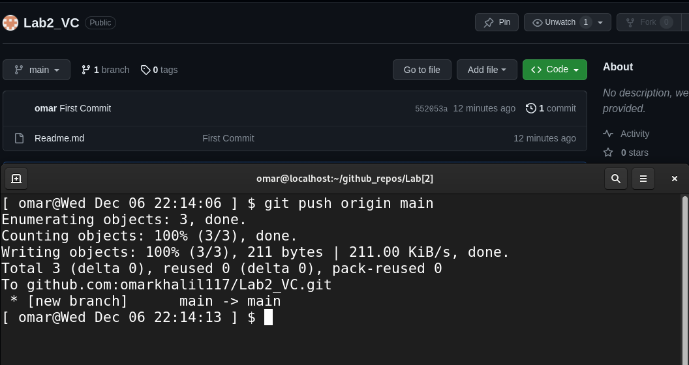

## Create two branches (dev & test), create one file on each branch, and push these changes to the remote repo.
### Switch to dev branch and add index.html file 
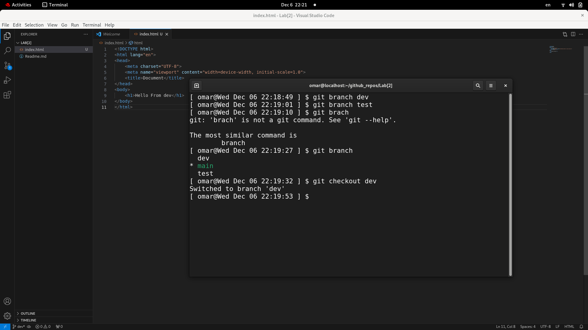
### See branch dev status and commit the changes
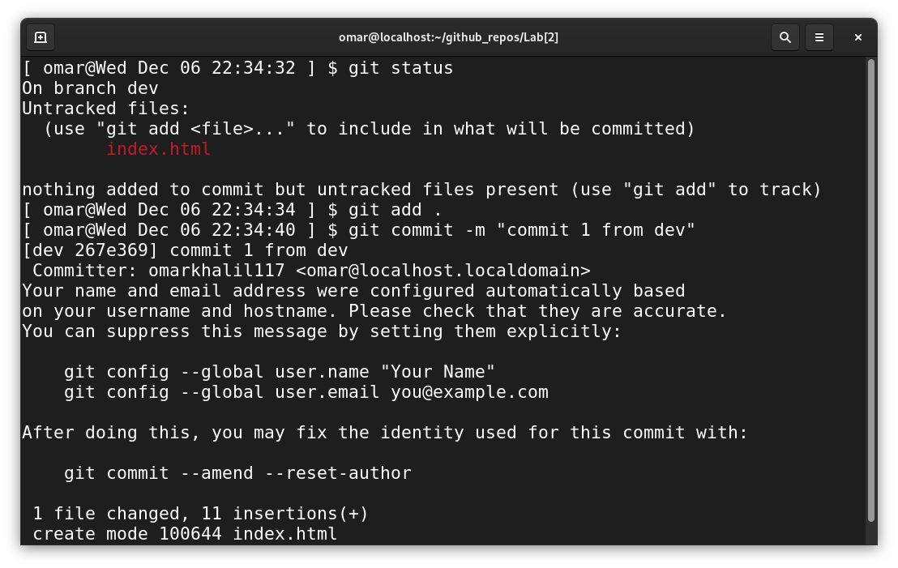
### When we checkout to main branch index.html file is not visible anymore
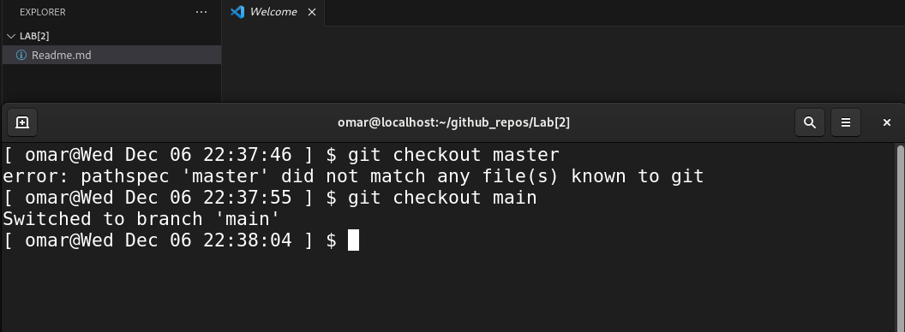
### Switch to test branch and add style.css file and committing the changes
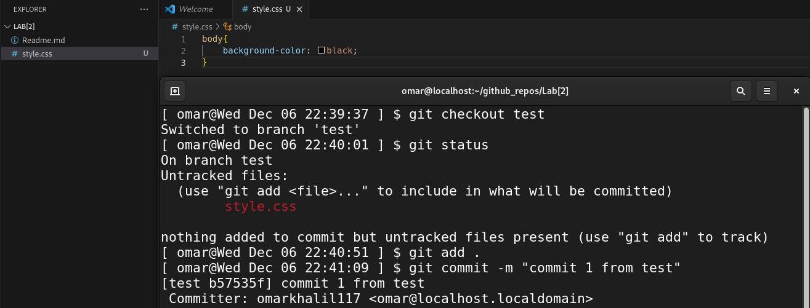
### Push dev & test branches to the remote repo
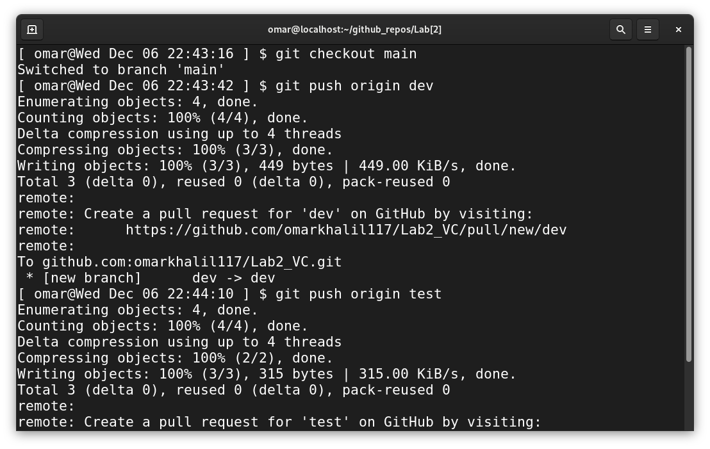

## Merge this changes on Master branch and then push it to your remote master branch.
### Merging branch (dev,test) with the main branch 
- Notice that both branches files are merged 
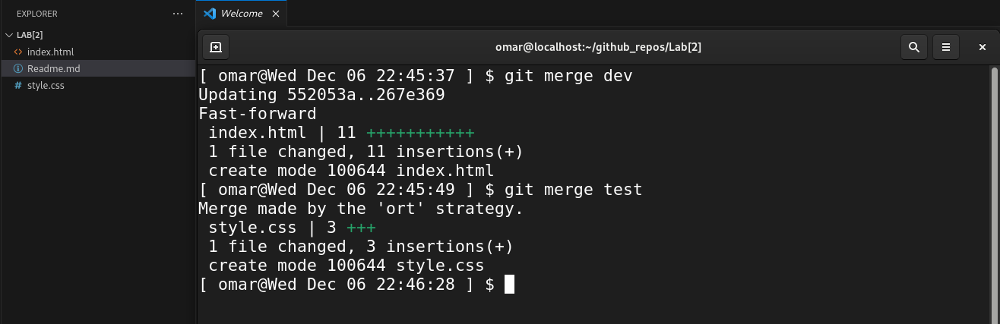
### Push the main branch after merging 
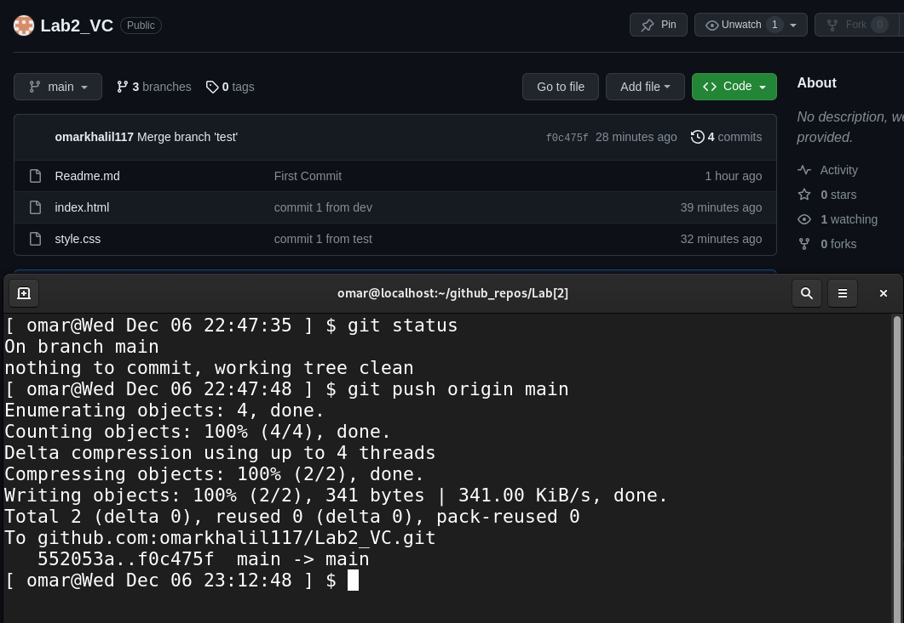

## Tell me how to remove them locally and remotely.
- ### remove them locally:
  *git branch -d dev*
  *git branch -d test*
  
- ### delete from remote repo: 
  *git push origin :dev*
  *git push origin :test*
## Create an annotated tag with tagname (v1.7).
## Push it to the remote repository.
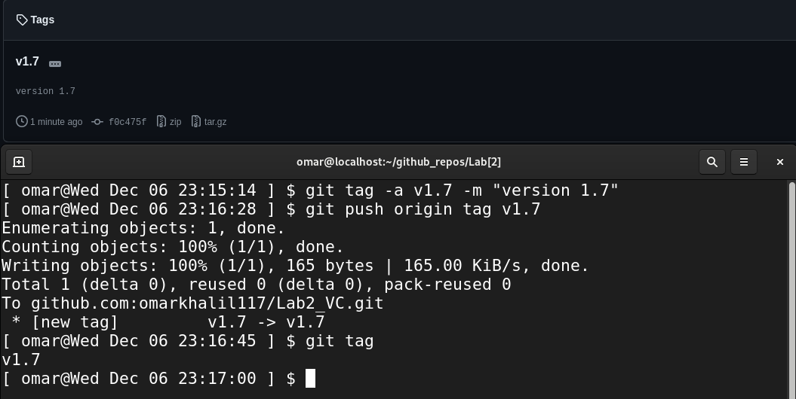
## Tell me how to list tags.
### using *git tag* command
## Tell me how to delete tag locally and remotely.
- ### local:
   *git tag -d v1.7*
- ### remote:
   *git push origin --delete v1.7*

## Add an image in the README.md file
using **
  
